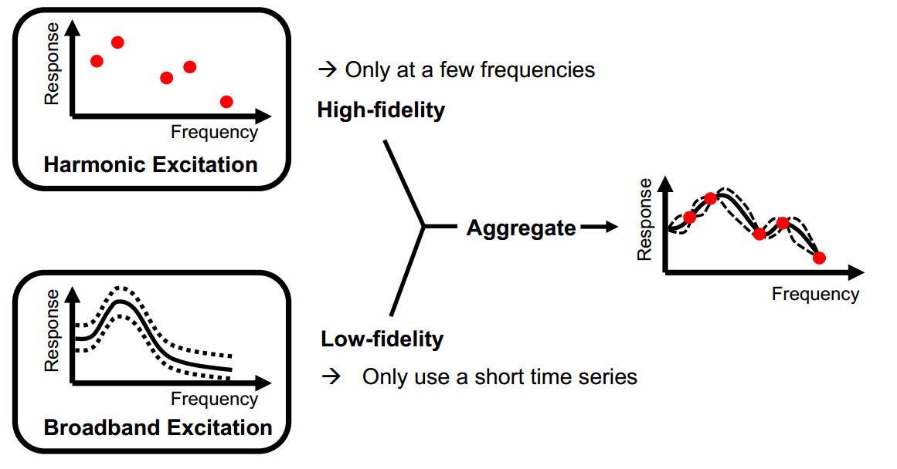
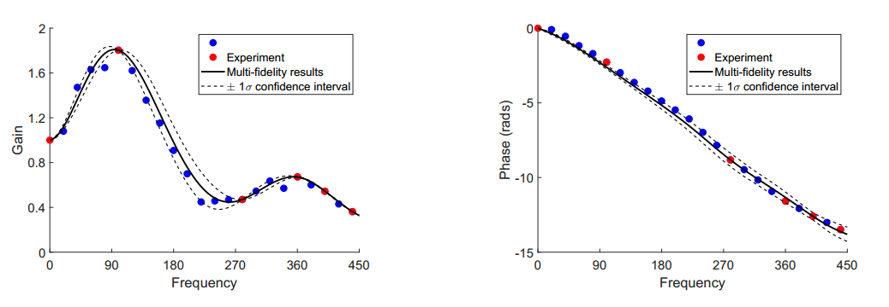

## A Multi-fidelity Gaussian Process Approach to Identify Flame Model

  

### 1. Highlight

- proposed a novel machine-learning-based strategy to effectively reduce the uncertainty in flame model identification, thus ensuring reliable combustor design and analysis.
- This strategy relies on a multi-fidelity Gaussian Process model, which effectively aggregates low/high fidelity identification results and balances the trade-off between computational effort and accuracy.
- We successfully tested the multi-fidelity strategy on the data acquired from a test rig.
- Our results indicate that given the same computational budget, the proposed strategy yields globally more accurate, robust flame model identification.

This work was initially presented in [CM4P ECCOMAS 2019](https://cm4p.org/past-editions-2/) conference, and was later accepted in the journal:

Guo S., Silva C. F., Polifke W., Robust Identification of Flame Frequency Response via
Multi-Fidelity Gaussian Process Approach. *Journal of Sound and Vibration*, 2021.

### 2. Motivation

Flame model constitutes a major source of uncertainty in combustion instability predictions. This uncertainty generally stems from the imperfect model identification from noisy time-series data. State-of-the-art identification methods are either accurate but terribly slow, or fast but contains significant uncertainties. 

### 3. Methodology

We aim to fully exploit the respective strengths, while avoiding the weaknesses of the state-of-the-art methods by proposing a multi-fidelity machine learning approach to identify flame mdoels. This approach assimilates the global trend provided by the low-fidelity results and local estimates provided by the high-fidelity results, thus leading to a globally accurate and
robust flame model identification even in the presence of strong noise.

### 4. Results

- Given the same computational budget, our multi-fidelity strategy performs better than allocating resources solely to a single state-of-the-art method. 

- We extended our strategy to aggregate data from both simulations and experiments, demonstrating its flexibility in practical usages.

  

### 5. Folder structure

**1. Presentation**: the slides presented in [CM4P ECCOMAS 2019](https://cm4p.org/past-editions-2/) conference.

**2. MatlabScripts**: MATLAB source code and data to reproduce the results. The code and data are organized in individual folders corresponding to different sections in the paper. 

- **BroadbandForcing**: Routines to generate broadband signals u' and Q' for system identification;

- **HarmonicForcing**: Routines to perform harmonic forcing and identify FTF at discrete frequencies. In the current study, frequencies are only selected in 50:3:500 for the ease of coding. In real applications, harmonic forcing frequencies should be chosen continuously.

- **Ref_FIR**: Routines to plot the reference FTF model (Fig. 2)

- **SNR1_gain**: Routines to investigate the characteristics of MFGP approach and sensitivity of harmonic excitation settings, only for gain

- **SNR1_phase**: Routines to investigate the characteristics of MFGP approach and sensitivity of harmonic excitation settings, only for phase
